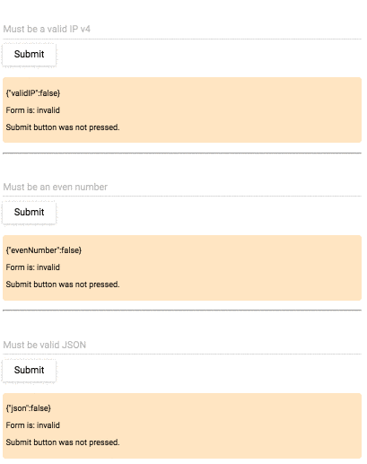
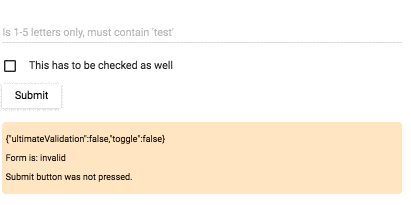
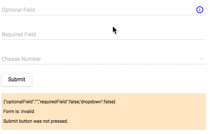
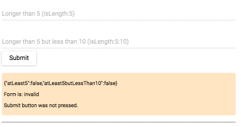
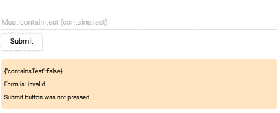

"WORK & DOCS IN PROGRESS"
------------------------

**FOR TESTING ONLY - WAIT for production release.**

About this release: 

- Because it has **material-ui** wrapped around it, you have to initialize 'react-tap-event-plugin' (see below how) 
- For more info check GITHUB **(example folder)**

There are two branches:

**develop**

 - where core is developed
 - no extra styles

**material-ui**

 - this branch comes from develop but has material-ui around it
 - so when you use material design components you can use them with validations

-----------------------------------

**STYLES**
==========

 - only few basic styles    
 - styles are written in .styl(stylus)
 - there is also compiled version **styles.css** so include it in your app

-----------------------------------

**SET UP**
==========

1. initialize material-ui
    
    `import {init} from 'react-form-essentials';` 
    
    `init();`
    
    
2. load components and use them as shown below
    
    `import {ValidForm, Field} from 'react-form-essentials';`

-----------------------------------

**Form syntax**
===================

    <ValidForm errors={errorsObject}
			    debug={true}
			    onSubmit={dummyHandler}>
        <!--children here-->
	</ValidForm>

 - **debug**: will provide form feedback
 - **errors**: send errors object available for all child components ( if this object has property with the name of child component, the value will be displayed as error for that component - this is good when checking errors asynchronously in "container components")
 - **onSubmit**: is a submit handler (use from outside container)

---------------------

**Field syntax**
===================

    <Field name="someName"
       type="text"
       placeholder="HintText"
       required={true}
       validator={isLength:2}
       icons={false}
       label="Some label">
	</Field>

 - **name**: input name
 - **type**: input type
 - **placeholder**: hint text for input
 - **validator**: isLength:1:5|isAlpha|contains:test
 - **icons**: show/hide icons (default: true)
 - **label**: input label
 - **defaultError**: default error message when field is invalid

**Dropdown syntax**
===================
**TODO**

**Toggle syntax**
===================
**TODO**

-----------------------------------

**Supported validators:**
A LOT :) 
...comming soon

SAMPLES
=======

-----------------------------------

-----------------------------------

-----------------------------------

-----------------------------------

